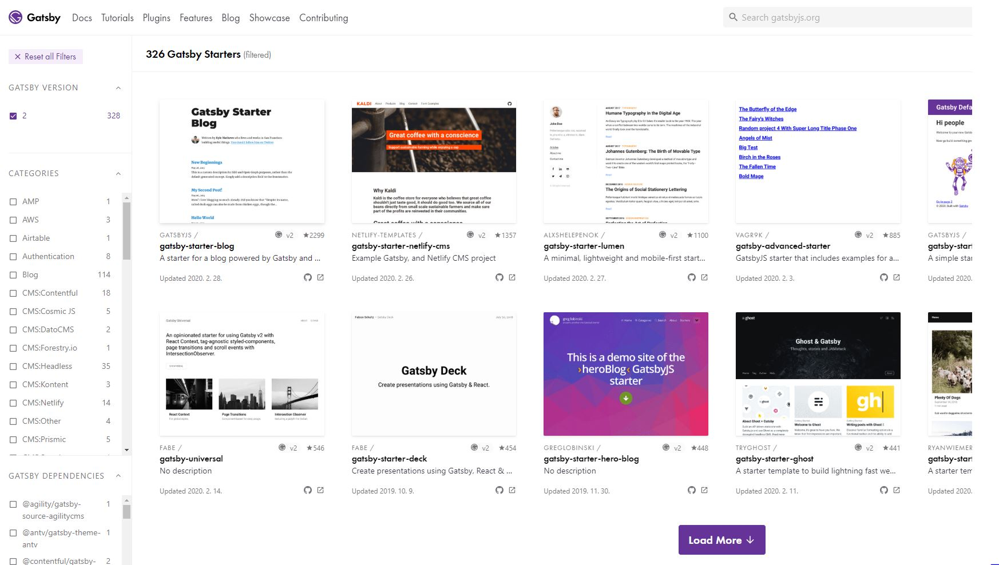
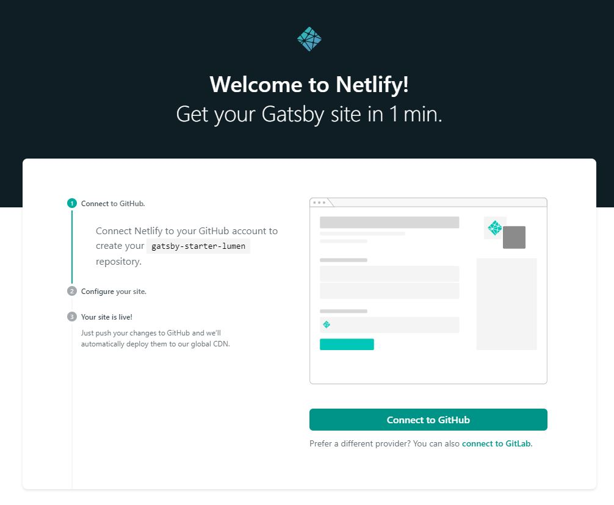
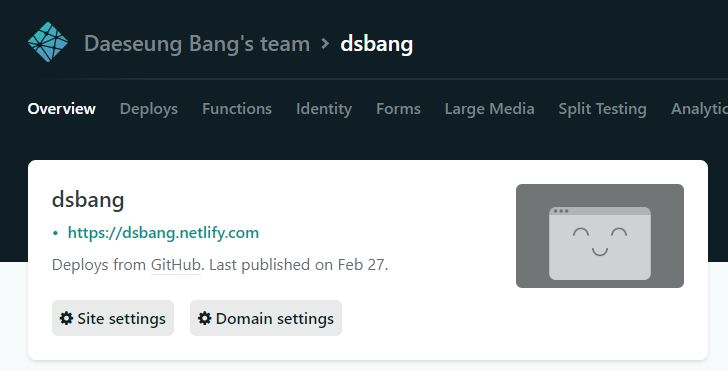

## Gatsby+Netlify로 나만의 블로그 갖기(2)


여기서는 일단 설치과정을 정리하겠습니다.

### 설치 + Netlify에 Deploy


저는 일단 netlify에 deploy하는 것을 가정하겠습니다.

netlify는 deploy서버인데, github repo가 바뀌면 자동으로 build를 해주는 기능을 가지고 있습니다.

우리가 글 한개 올릴때마다 수동으로 build를 안해줘도되는게 가장 큰 장점이죠.


https://www.netlify.com/

에 가입후 로그인을 해놓습니다.


그리고 gatsby-cli를 설치합니다.

```shell
npm install -g gatsby-cli
```


https://www.gatsbyjs.org/starters/?v=2

여기서 마음에 드는 starter의 git repo 주소를 찾아옵니다.




튜토리얼을 보면 

```shell
## 하지마세요
gatsby new [폴더명] [git repo]
```

로 git 을 따오는 모습을 볼 수 있습니다만 저는 그렇게 하지 않겠습니다.

처음했을때 빌드가 안되더라고요... (gatsby new가 git clone과 다르게 무언가 건드리는것 같습니다...)


https://app.netlify.com/start/deploy?repository= + [git repo주소] 로 접속합니다.

저같은경우는 gatsby-starter-lumen을 선택하였기에

https://app.netlify.com/start/deploy?repository=https://github.com/alxshelepenok/gatsby-starter-lumen

에 접속하였습니다.



여기소 초록색 connect to GitHub버튼을 클릭하면

내 깃허브에 해당 repo를 클론해오고 빌드를 하기 시작합니다.


그리고 로컬에서 내 깃 repo 주소를 클론해오면 이제 블로그를 편집 할 수 있고,


```shell
npm install ## 최초실행시

gatsby develop
```

명령어로 로컬에서 develop모드로 접속이 가능하며


 git push를 하면 netlify에 자동으로 빌드가 됩니다.


## 블로그를 내것으로 만들기

 gatsby-starter-lumen기준으로 말하겠습니다.

starter마다 구조가 다른데

이건 특히, 구조를 완전 바꾸어 놨습니다. 다른 스타터를 선택하셨으면 해당사항이 없을경우가 많습니다.

또한, 같은  gatsby-starter-lumen이라도... 이게 개발을 활발히 하고 있는것 같아서, 과거 블로그들과도 조금 다른것 같습니다. (저는 https://www.regyu.dev/etc/start-gatsby-for-blog/ 여기에서 많이 참조하였습니다.)


간단합니다.

최상단의 config.js 를 수정하면 됩니다.

disqus에 가입하셔서 disqusShortname을 입력하면 댓글창이 포스트별로 만들어집니다.

google analytics에 가입하셔서 googleAnalyticsId도 입력하세요

authors에  contacts 항목들을 지울때는 주의가 필요합니다. 이 항목들을 불러 오는 쿼리가 있거든요.

src>hooks>use-site-metadata.js에서 해당 항목들을 지우시고 난 후 config에서도 지웁시다.(여기서만 지우고 아예 config에서는 안지우는편이 좋을수도 있습니다.)


gatsby-config.js에서 

icon: "static/avataaars.png" 부분을 수정하시면, 아이콘 도바뀝니다.


## 그래서 글은 어떻게 써??

두가지 방법이 있습니다.

하나는 로컬에서 마크다운 파일을 작성하는 방법이고, 다른 하나는 웹에서 글을 작성하는 것입니다.


### 로컬에서 마크다운 편집하기

글들은 최상단에 contents폴더에 마크다운 파일로 저장하면 됩니다.

포스트는 블로그의 포스트를 의미하고, 페이지는 포스트가 아니라 주로 정적으로 쓰는 용도의 페이지를 의미합니다.


posts폴더안에 있는 기존의 문서 룰을 따라서 파일을 생성하는것이 좋습니다.

특히 상단의 ---으로 둘러싼 부분이 graphql이 읽어 들이는 부분인데, slug와 socialImage부분은 없어도 무방하지만, 다른 부분은 되도록 채워주시기 바랍니다.

```markdown
---
title: The Origins of Social Stationery Lettering
date: "2016-12-01T22:40:32.169Z"
template: "post"
draft: false
slug: "the-origins-of-social-stationery-lettering"
category: "Design Culture"
description: "Pellentesque habitant morbi tristique senectus et netus et malesuada fames ac turpis egestas. Vestibulum tortor quam, feugiat vitae, ultricies eget, tempor sit amet, ante."
socialImage: "/media/image-3.jpg"
---
```

draft가 false인 경우에만 블로그가 노출되니 draft가 노출되지 않길 바라신다면 true로 바꿔주세요.


그런데 마크다운 파일에 여러 이미지들을 넣어야되는데, 마크다운 파일기준이 아니라, 폴더별로 정리하고 싶다?

index.js 이런 룰이 마크다운파일에서도 통합니다.


예를 들면 

``` 
content/posts/2016-01-12---The-Origins-of-Social-Stationery-Lettering.md
```

라는 파일의 주소는 /posts/2016-01-12---The-Origins-of-Social-Stationery-Lettering 이고

```
content/posts/2016-01-12---The-Origins-of-Social-Stationery-Lettering/index.md
```

의 주소도 /posts/2016-01-12---The-Origins-of-Social-Stationery-Lettering 입니다.

그러면 2016-01-12---The-Origins-of-Social-Stationery-Lettering 폴더에 첨부파일을 많이 넣어도 밖으로 튀어나오지는 않겠죠?


### 웹에서 마크다운 편집하기 - netlify-cms

gatsby-starter-lumen은 netlify-cms도 지원을 합니다.

도메인/admin 으로 접속을 하면 로그인이 가능합니다.





netlify의 site settings로 들어가 identity탭에서 유저를 관리할 수 있는데, 저만 가입하고 invite only로 바꾸었습니다. 저만쓸거니까요.


admin페이지에서 글을 관리할 수 있습니다.

여기서 글에대한 CRUD가 발생하면 즉시 git push가 되며, 사이트도 rebuild하게 됩니다.


저는 여기서 필수요소들만 작성하고 git pull을 하여 로컬에서 작성할 예정입니다.

graphql 요소들을 직접 작성하기에는, 위험도가 너무 높거든요. 예를 들면 카테고리의 경우 글자 하나만 틀려도 다른 카테고리로 인식합니다.


여기까지가 설치해서 사용하기까지였고, 다음은 각종 플러그인을 사용한 커스터마이제이션을 하겠습니다.

솔직히 개인적으로 여기까지만 하고 손 안댔어야 했습니다. ㅠㅠ..